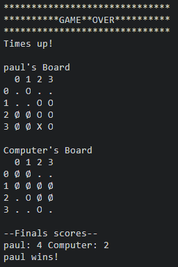
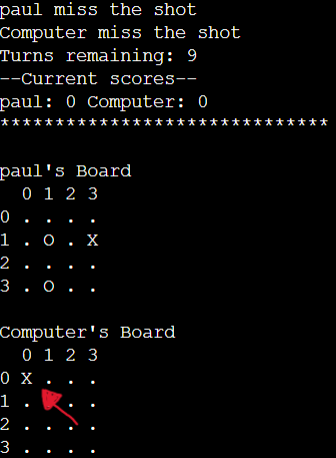
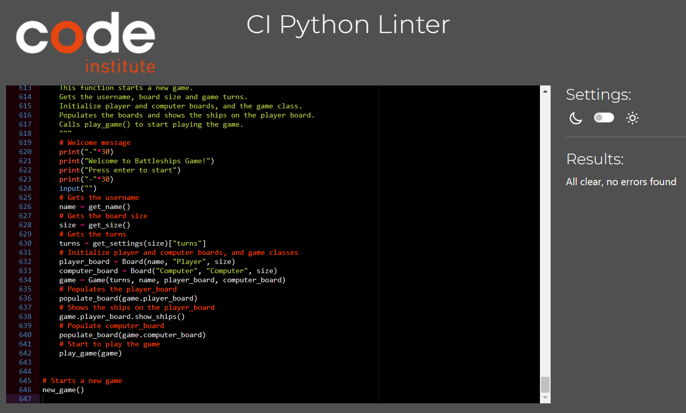

# Battleships game

## How to play

Battleships game it's inspired by the classic [Battleship (game)](https://en.wikipedia.org/wiki/Battleship_(game)).

In this version, the game has a turn limit depending on the board size chosen by the player, and three different types of ships with varying point values and sizes:

- Big(3x3) = 1 point
- Medium(2x2) = 2 points
- Small(1x1) = 3 points

After entering your username and the size of the boards, two boards will be randomly generated, one for each player. The player's ships are indicated on his board with and **O**, while the computer's ships remains hidden.

Then, player and computer by turns try to sink each other's ships.

Hits are marked on the board with **Ø**, while misses are marked with **X**.

The winner it's the first who sinks all opponent's ships or who has the highest score when the turns are over.

Once the game it's over you can enter **Y** to play again or **N** to stop playing.

## Features

### Existing features

- Random board generation

    - After the player enters the username and the board size, two boards with that size are generated and populated randomly with the correct amount of ships for that board size.
    - Also shows the information of the ships on this game aswell and the turns limit.
    - The player cannot see where the computer's ships are placed.

        

- Input validation and error-checking
    
    - For the username:
        - Username cannot be empty
        - Username only can contain letters, digits or spaces
        - Cannot start or end with space
        - Cannot have more two or more spaces in a row
        - Must be between 4-11 characthers
    
        More details on [Username testing](#username)

    - For the size:
        - Size cannot be empty
        - Sise must a numeric
        - Size must be between 4-10

        More details on [Size testing](#size)

    - For the row and column:
        - Row and column cannot be empty
        - Row and column must be integer numbers
        - Row and column must be between 0 and (board size-1)
        - A row and column that already missed cannot be introduced again
        - Cannot introduce the row and column of a sunk ship

        More detail on [Row and column testing](#row-and-columns)  

    - For play again:
        - Must not be empty
        - Must be 'Y', 'y', 'n' or 'N'
        
        More details on [Play again testing](#play-again)

- Data maintained in class instances

    - I have been using Game, Board and Ship Classes to work with the data, such as username, player board, computer board, turns limit...
    More detail on [Data model](#data-model)

- Different size of ships with differents points value

    - I used 3 types of ships on this proyect:
        
        - Small ship: It's a 1x1 ship with a value of 3 points
        - Medium ship: It's a 2x2 ship with a value of 2 points
        - Big ship: It's a 3x3 ship with a value of 1 points
    
        The small ship have a bigger value than the other ones because it's harder to hit a 1x1 than a 2x2 or 3x3.

- Option to play again when finish

    - Once the game it's over the player have the option to play again or to stop playing.

        

- Turns limit game

    - The game has a turn limit based on the size of the board. Once it reches 0 the game finish and who has more points wins.

        

- Round information

    - After the player make a guess, a round information will appear to let him know if he hitted or not, if the computer hitted or not, the turns remaing and the scores. Also will print the updated boards with the last hits/misses.

        

- Game over information

    - When the game it's over, will show the reason why the game it's over, the final scores, the final boards with the remaing computer ships on it, and the winner.

        

## Data model

I decided to use Game, Board and Ship classes as my model

- **Ship Class**

    This class it's a superclass for 3 subclasses:
    
    - SmallShip
    - MediumShip
    - BigShip

    Each subclass have a type and value attribute, and each subclass inherits from Ship class:

    - *coordinates* attribute: Stores the coordinates of the ship on the board. The data it's stored as a list of lists.
    - *get_type* method: Gets the type of the ship
    - *get_value* method: Gets the value of the ship

- **Board Class**

    This class stores the following attributes:

    - *name*: Stores the player username
    - *type*: Stores the type of the board(Player or Computer)
    - *size*: Stores the size of the board chosen by the player
    - *board*: Stores a list of list that represents the board
    - *ships*: Stores instances of Ship
    - *misses*: Stores the coordinates of the guesses that missed
    - *sunk*: Stores the coordinates of the ships sunk

    This class also has the following methods:

    - *print*: Prints the board
    - *guess*: Check if there is a ship on the coordinate passed as paramater
    - *add_ship*: Add the ship passed as parameter to the ships attribute
    - *show_ships*: Shows coordinates of the ships on the board attribute.

- ***Game Class**

    This class stores the following attributes:

    - *turns*: Stores the remaining turns of the game
    - *player_name*: Stores the username of the player
    - *player_score*: Stores the player's score
    - *computer_score*: Stores the computer's score
    - *player_board*: Stores an instance of Board for the player
    - *computer_board*: Stores an instance of Board for the computer

    This class also has the following methods:

    - *print_scores*: Prints the current scores
    - *increment_score*: Increments the player or computer score depending on the type parameter.
    - *turns_remaining*: Prints the turns attribute.

## Testing

### Manual testing

- #### Username

    **Test**|**Expected outcome**|**Test performed**|**Outcome**|**Test passed**
    ---|---|---|---|:---:
    Empty|Username cannot be empty. Please introduce a valid username (4-11 characters)|Introduced empty username|Username cannot be empty. Please introduce a valid username (4-11 characters)|Yes
    Not alphanumeric|Username only can contain letters, digits or spaces. Please introduce a valid username (4-11 characters)|Introduced "#"|Username only can contain letters, digits or spaces. Please introduce a valid username (4-11 characters)|Yes
    Less than 4 characters|Username too short. Please introduce a valid username (4-11 characters)|Introduced "123"|Username too short. Please introduce a valid username (4-11 characters)|Yes
    More than 11 characters|Username too long. Please introduce a valid username (4-11 characters)|Introduced "0123456789abcd"|Username too long. Please introduce a valid username (4-11 characters)|Yes
    Starts with space|Username cannot start or end with a space. Please introduce a valid username (4-11 characters)|Introduced " Paul"|Username cannot start or end with a space. Please introduce a valid username (4-11 characters)|Yes
    Ends with space|Username cannot start or end with a space. Please introduce a valid username (4-11 characters)|Introduced "Paul "|Username cannot start or end with a space. Please introduce a valid username (4-11 characters)|Yes
    Two spaces in a row|Username cannot have more than one space in a row. Please introduce a valid username (4-11 characters)|Introduced "Pa&nbsp;&nbsp;ul"|Username cannot have more than one space in a row. Please introduce a valid username (4-11 characters)|Yes
    Valid|Please introduce the size of the board(options availables 4-10)|Introduced "Paul"|Please introduce the size of the board(options availables 4-10)|Yes

- #### Size

    **Test**|**Expected outcome**|**Test performed**|**Outcome**|**Test passed**
    ---|---|---|---|:---:
    Empty|Size cannot be empty. Please introduce a valid size (options availables 4-10)|Introduced empty size|Size cannot be empty. Please introduce a valid size (options availables 4-10)|Yes
    Not numeric|Size must be a positive intenger number. Please introduce a valid size (options availables 4-10)|Introduced "Paul"|Size must be a positive intenger number. Please introduce a valid size (options availables 4-10)|Yes
    Not positive numeric|Size must be a positive intenger number. Please introduce a valid size (options availables 4-10)|Introduced "-1"|Size must be a positive intenger number. Please introduce a valid size (options availables 4-10)|Yes
    Less than 4|Invalid size option. Please introduce a valid size (options availables 4-10)|Introduced "3"|Invalid size option. Please introduce a valid size (options availables 4-10)|Yes
    Greater than 10|Invalid size option. Please introduce a valid size (options availables 4-10)|Introduced "11"|Invalid size option. Please introduce a valid size (options availables 4-10)|Yes
    4|Turns: **10** Small ships: **2** Medium ships: **0** Big ships: **0** Random generated **4x4** board for player and computer (Only shows the ships on the player's board. Also shows username above player board)|Introduced "4"||Yes
    5|Turns: **15** Small ships: **3** Medium ships: **1** Big ships: **0** Random generated **5x5** board for player and computer (Only shows the ships on the player's board. Also shows username above player board)|Introduced "5"||Yes
    6|Turns: **20** Small ships: **4** Medium ships: **2** Big ships: **0** Random generated **6x6** board for player and computer (Only shows the ships on the player's board. Also shows username above player board)|Introduced "6"||Yes
    7|Turns: **25** Small ships: **5** Medium ships: **2** Big ships: **1** Random generated **7x7** board for player and computer (Only shows the ships on the player's board. Also shows username above player board)|Introduced "7"||Yes
    8|Turns: **35** Small ships: **6** Medium ships: **2** Big ships: **2** Random generated **8x8** board for player and computer (Only shows the ships on the player's board. Also shows username above player board)|Introduced "8"||Yes
    9|Turns: **40** Small ships: **7** Medium ships: **3** Big ships: **2** Random generated **9x9** board for player and computer (Only shows the ships on the player's board. Also shows username above player board)|Introduced "9"||Yes
    10|Turns: **50** Small ships: **8** Medium ships: **3** Big ships: **3** Random generated **10x10** board for player and computer (Only shows the ships on the player's board. Also shows username above player board)|Introduced "10"||Yes

- #### Row and Columns

    **Test**|**Expected outcome**|**Test performed**|**Outcome**|**Test passed**
    ---|---|---|---|:---:
    Row empty|Row and column cannot be empty. And be asked to introduce a valid column and row.|Introduced "2" for column and empty for row|Row and column cannot be empty. And got asked to introduce a valid column and row.|Yes
    Column empty|Row and column cannot be empty. And be asked to introduce a valid column and row.|Introduced empty for column and "3" for row|Row and column cannot be empty. And got asked to introduce a valid column and row.|Yes
    Row not intenger|Row and column must be integer numbers. And be asked to introduce a valid column and row.|Introduced "3" for column and "a" for row|Row and column must be integer numbers. And got asked to introduce a valid column and row.|Yes
    Column not intenger|Row and column must be integer numbers. And be asked to introduce a valid column and row.|Introduced "a" for column and "0" for row|Row and column must be integer numbers. And got asked to introduce a valid column and row.|Yes
    Column and row that already missed|You already missed a shot on "Coordinate introduced". And be asked to introduce a valid column and row.|Introduced "0" for column and "0" for row, made sure it missed and introduced the same again|You already missed a shot on [0, 0]. And got asked to introduce a valid column and row.|Yes
    Column and row were it's a sunk ship|You have already sunk a ship on "Coordinate introduced". And be asked to introduce a valid column and row.|Introduced "1" for column and "0" for row, made sure it hitted and introduced the same again|You have already sunk a ship on [1, 0]. And got asked to introduce a valid column and row.|Yes

- #### Row and column range per board size

    - Board size 4

        **Test**|**Expected outcome**|**Outcome**|**Test passed**
        ---|---|---|:---:
        [0,0]|No errors|No errors|Yes
        [1,1]|No errors|No errors|Yes
        [2,2]|No errors|No errors|Yes
        [3,3]|No errors|No errors|Yes
        [4,4]|Row and column must be between 0 and 3. And be asked to introduce a valid column and row.|Row and column must be between 0 and 3. And got asked to introduce a valid column and row.|Yes
        
    - Board size 5

        **Test**|**Expected outcome**|**Outcome**|**Test passed**
        ---|---|---|:---:
        [0,0]|No errors|No errors|Yes
        [1,1]|No errors|No errors|Yes
        [2,2]|No errors|No errors|Yes
        [3,3]|No errors|No errors|Yes
        [4,4]|No errors|No errors|Yes
        [5,5]|Row and column must be between 0 and 4. And be asked to introduce a valid column and row.|Row and column must be between 0 and 4. And got asked to introduce a valid column and row.|Yes

    - Board size 6

        **Test**|**Expected outcome**|**Outcome**|**Test passed**
        ---|---|---|:---:
        [0,0]|No errors|No errors|Yes
        [1,1]|No errors|No errors|Yes
        [2,2]|No errors|No errors|Yes
        [3,3]|No errors|No errors|Yes
        [4,4]|No errors|No errors|Yes
        [5,5]|No errors|No errors|Yes
        [6,6]|Row and column must be between 0 and 5. And be asked to introduce a valid column and row.|Row and column must be between 0 and 5. And got asked to introduce a valid column and row.|Yes

    - Board size 7

        **Test**|**Expected outcome**|**Outcome**|**Test passed**
        ---|---|---|:---:
        [0,0]|No errors|No errors|Yes
        [1,1]|No errors|No errors|Yes
        [2,2]|No errors|No errors|Yes
        [3,3]|No errors|No errors|Yes
        [4,4]|No errors|No errors|Yes
        [5,5]|No errors|No errors|Yes
        [6,6]|No errors|No errors|Yes
        [7,7]|Row and column must be between 0 and 6. And be asked to introduce a valid column and row.|Row and column must be between 0 and 6. And got asked to introduce a valid column and row.|Yes

    - Board size 8

        **Test**|**Expected outcome**|**Outcome**|**Test passed**
        ---|---|---|:---:
        [0,0]|No errors|No errors|Yes
        [1,1]|No errors|No errors|Yes
        [2,2]|No errors|No errors|Yes
        [3,3]|No errors|No errors|Yes
        [4,4]|No errors|No errors|Yes
        [5,5]|No errors|No errors|Yes
        [6,6]|No errors|No errors|Yes
        [7,7]|No errors|No errors|Yes
        [8,8]|Row and column must be between 0 and 7. And be asked to introduce a valid column and row.|Row and column must be between 0 and 7. And got asked to introduce a valid column and row.|Yes

    - Board size 9

        **Test**|**Expected outcome**|**Outcome**|**Test passed**
        ---|---|---|:---:
        [0,0]|No errors|No errors|Yes
        [1,1]|No errors|No errors|Yes
        [2,2]|No errors|No errors|Yes
        [3,3]|No errors|No errors|Yes
        [4,4]|No errors|No errors|Yes
        [5,5]|No errors|No errors|Yes
        [6,6]|No errors|No errors|Yes
        [7,7]|No errors|No errors|Yes
        [8,8]|No errors|No errors|Yes
        [9,9]|Row and column must be between 0 and 8. And be asked to introduce a valid column and row.|Row and column must be between 0 and 8. And got asked to introduce a valid column and row.|Yes

    - Board size 10

        **Test**|**Expected outcome**|**Outcome**|**Test passed**
        ---|---|---|:---:
        [0,0]|No errors|No errors|Yes
        [1,1]|No errors|No errors|Yes
        [2,2]|No errors|No errors|Yes
        [3,3]|No errors|No errors|Yes
        [4,4]|No errors|No errors|Yes
        [5,5]|No errors|No errors|Yes
        [6,6]|No errors|No errors|Yes
        [7,7]|No errors|No errors|Yes
        [8,8]|No errors|No errors|Yes
        [9,9]|No errors|No errors|Yes
        [10,10]|Row and column must be between 0 and 9. And be asked to introduce a valid column and row.|Row and column must be between 0 and 9. And got asked to introduce a valid column and row.|Yes

- #### Hits and misses

    **Test**|**Expected outcome**|**Test performed**|**Outcome**|**Test passed**
    ---|---|---|---|:---:
    Player hit|**Username** hit a **type of ship** and gains **amount of points**. Computer miss/hit. Turns remaining. Current scores. Mark the hit on the computer board with a "Ø"|Played rounds until I hitted a ship **[2,2]**||Yes
    Computer hit|Player miss/hit. Computer hit a **type of ship** and gains **amount of points**. Turns remaining. Current scores. Mark the hit on the player board with a "Ø"|Played rounds until computer hitted a ship **[1,3]**||Yes 
    Player miss|**Username** miss the shot. Computer miss/hit. Turns remaining. Current scores. Mark the miss on the computer board with a "X"|Played rounds until I missed a ship **[0,0]**||Yes 
    Computer miss|Player miss/hit. Computer miss the shot. Turns remaining. Current scores. Mark the miss on the player board with a "X"|Played rounds until computer missed a ship **[3,1]**||Yes

- #### Possibles game endings

    To make the testing process faster, I have been changing the **GAME_SETTINGS** constant on my local proyect.

    - Player wins

        **Test**|**Expected outcome**|**Test performed**|**Outcome**|**Test passed**
        ---|---|---|---|:---:
        No more turns|"GAME OVER Times up!" Shows both boards(with the ships on the computer board aswell). Shows the final scores and "**Username** wins!"|Set turns, small ships and medium ships to 2 and played games until I won||Yes
        All computer ships sunk|"GAME OVER All Computers's ships sunk" Shows both boards. Shows the final scores and "**Username** wins!"|Played games until I sunk all the computer ships||Yes
        All computer ships sunk|"GAME OVER All Computers's ships sunk Times up!" Shows both boards. Shows the final scores and "**Username** wins!"|Set turns and small ships to 1 and played games until I won||Yes
    
    - Computer wins

        **Test**|**Expected outcome**|**Test performed**|**Outcome**|**Test passed**
        ---|---|---|---|:---:
        No more turns|"GAME OVER Times up!" Shows both boards(with the ships on the computer board aswell). Shows the final scores and "Computer wins"|Set turns, small ships and medium ships to 2 and played games until computer won||Yes
        All player ships sunk|"GAME OVER All **Username** ships sunk" Shows both boards(with the ships on the computer board aswell). Shows the final scores and "Computer wins"|Played games until computer sunk all the player ships||Yes
        All player ships sunk on last round|"GAME OVER All **Username** ships sunk Times up" Shows both boards(with the ships on the computer board aswell). Shows the final scores and "Computer wins"|Set turns and big ships to 1 and played games until computer won||Yes

    - Tie

        **Test**|**Expected outcome**|**Test performed**|**Outcome**|**Test passed**
        ---|---|---|---|:---:
        No more turns|"GAME OVER Times up!" Shows both boards(with the ships on the computer board aswell). Shows the final scores and "it's a tie"|Set small ships and turns to 1, and played games until tied||Yes
        Last ship destroyed on the same round|"GAME OVER All **Username** ships sunk All Computers's ships sunk" Shows both boards(with the ships on the computer board aswell). Shows the final scores and "it's a tie"|Set big ships to 1 and turns to 2, and played games until both hitted||Yes
        Last ship destroyed on the last round|"GAME OVER All **Username** ships sunk All Computers's ships sunk Times up!" Shows both boards(with the ships on the computer board aswell). Shows the final scores and "it's a tie"|Set big ships and turns to 1, and played games until both hitted||Yes

- #### Play again

    **Test**|**Expected outcome**|**Test performed**|**Outcome**|**Test passed**
    ---|---|---|---|:---:
    Empty|Input cannot be empty (Valids inputs: Y, y, N, n). Introduce Y to play again or N to stop|Introduced empty|Input cannot be empty (Valids inputs: Y, y, N, n). Introduce Y to play again or N to stop|Yes
    not ["n","N","Y","y"]|**Input** is not a valid input(Valids inputs: Y, y, N, n) Introduce Y to play again or N to stop|Introduced "3"||Yes
    N|Thanks for playing!|Introduced "N"||Yes
    n|Thanks for playing!|Introduced "n"||Yes
    Y|Starts a new game|Introduced "Y"||Yes
    y|Starts a new game|Introduced "y"||Yes
    
### Validator testing

- No errors were returned when passing through [CI Python Linter](https://pep8ci.herokuapp.com/)

    

## Deployment and Local Development

### Deployment

This proyect was deployed using Code Institute's mock terminal for Heroku.

1.  Fork or clone [this repository](https://github.com/PaaulCB/Battleships-game).
2.  Create a new heroku app

    

3.  Go to settings

    

4.  Set the buildpacks to Python and NodeJS in that order

    

5.  Go to deploy and link the heroku app to the repository

    

6.  Click **Enable Automatic Deploys**

### How to clone the repository

1.  Go to [Battleships Game](https://github.com/PaaulCB/Battleships-game).
2.  Above the list of files, click **Code**.

    

3.  Copy the URL for the repository.

    

4.  Open Git Bash.
5.  Change the current working directory to the location you want the cloned directory.
6.  Type **git clone**, and then paste the URL you copied earlier.

         git clone https://github.com/PaaulCB/Battleships-game

7.  Press **Enter** to create your local clone.

### How to fork the repository

1. Go to [Battleships game](https://github.com/PaaulCB/Battleships-game).
2. In the top-right corner of the page, click **Fork**.

   

3. Under "Owner," select the dropdown menu and click an owner for the forked repository.
4. By default, forks are named the same as their upstream repositories. Optionally, to further distinguish your fork, in the "Repository name" field, type a name.
5. Optionally, in the "Description" field, type a description of your fork.
6. Optionally, select **Copy the DEFAULT branch only**.
7. Click **Create fork**.